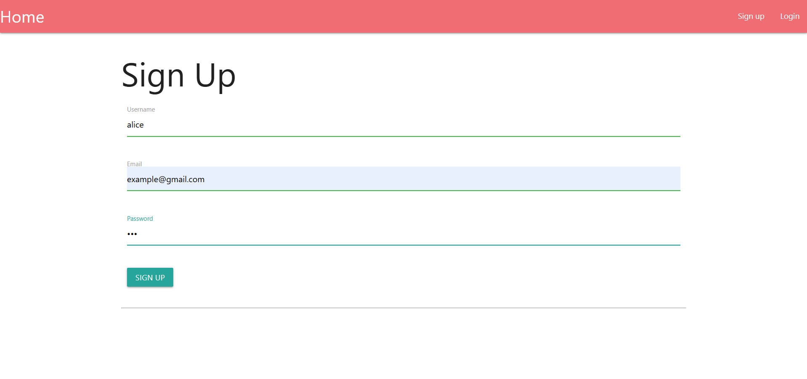

- Đầu tiên ta cần đăng kí để login được vào trang chính

- Sau khi login thành công ta rà soát 1 lượt các chức năng chính trong trang 
+ Dashbroad : chỉ là description rằng trang web này giúp ta quản lý tài khoản và hoạt động
+ Expense : nơi ta nhập dữ liệu chi tiêu và có thể thấy rằng front-end đã validate các giá trị đúng input

- Ấn generate report để sinh ra 1 bản chi tiêu như ta đã nhập thành 1 file .csv ở trang inbox
 
- Thử download về và nó sẽ trả về data mà mình truyền vào
- Vì lab đã mô tả “oder” cộng với dữ liệu được trả về nên ta đã nghĩ đến
  “SQL injection” nhưng “CSV injection” cũng có khả năng
- write-up lab này là SQL injection nên việc thử CSV tạm bỏ qua vì ta đã thử nhiều giá trị và nó không trả về 
- tại sao tôi nghĩ đến hướng SQL injection vì sau khi ta tạo 1 bản ghi và generate nó thành 1 file và trả ra đúng 3 thông tin ứng với mỗi cột thì backend có thể truy vấn như sau :
“ SELECT description,amount,date FROM somethings “
- vì dữ liệu bị validate ở front-end nên ta dùng burp-suite để bypass , ta truyền thêm 1 dấu ‘ ở các giá trị để xem nó có trả về lỗi không thì đáng tiếc là nó trả về thuần string 
- lúc này ta dùng thử SELECT SLEEP(5) cũng không bị delay 
- khá chắc rằng input ở 3 tham số là không có hiệu quả 
- lúc này chú ý kỹ ở mục inbox rằng tên username được reflect lại thì

-  lúc này truy vấn có thể là :
“ SELECT description,amount,date FROM somethings WHERE username=’alice’  “
- ta thử register với username “ alice’ “ sau đó ta vẫn login được như thường và ta tạo bản ghi rồi generate để xem lại tên file 

- đã đúng như ta dự đoán backend lấy username để truy vấn , lúc này ta sử dụng kỹ thuật SQLi :
-> Kiểm tra được 3 số , version “sqlite”
-> Truy vấn tên bảng : ' UNION SELECT name,NULL,NULL FROM sqlite_master WHERE type='table'--
-> Truy vấn tên cột : ' UNION SELECT name,NULL,NULL FROM pragma_table_info('aDNyM19uMF9mMTRn')--
-> Truy vấn giá trị : ‘ UNION SELECT name,value,null FROM aDNyM19uMF9mMTRn--

->Flag:

