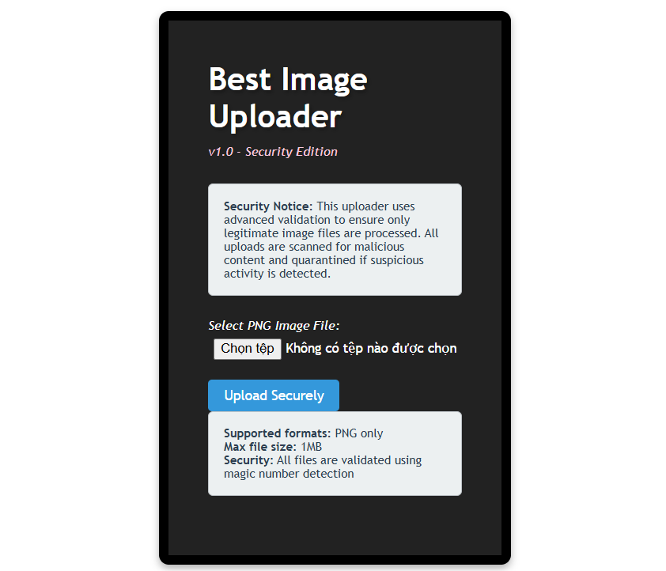
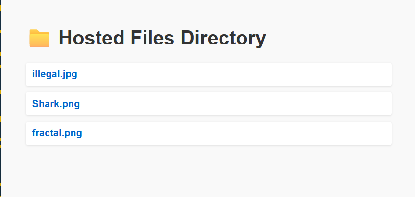
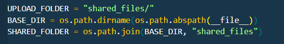
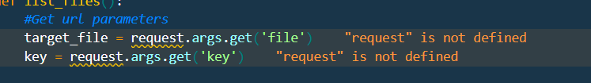
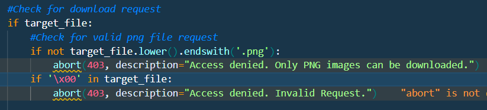
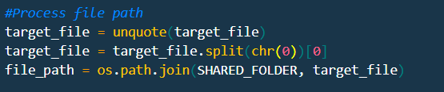
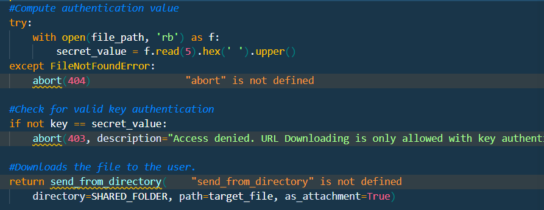
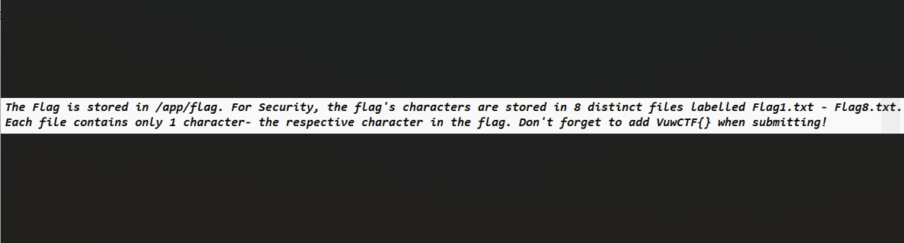
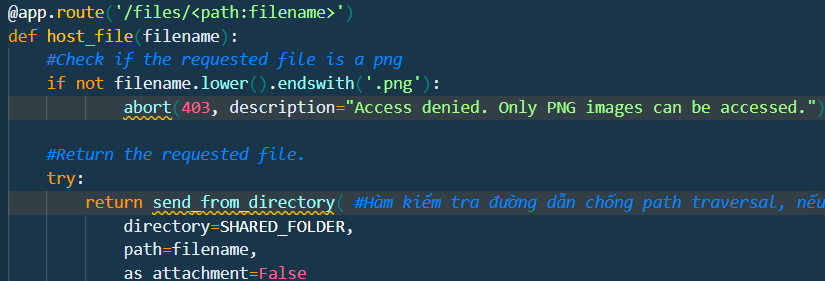
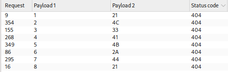

# Web Challenge Writeup - CTFTime 2026
 
> **Vulnerabilities:** Double URL Encoding Null-Byte Bypass, Path Traversal, Side-Channel Key Leakage (Oracle Attack)  

---

## 1. Overview

Trang web cung cấp hai chức năng chính:
- **Upload file:** `/upload`
- **Xem file:** `/files/<filename>`



Ban đầu, hệ thống có sẵn một số tệp hình ảnh. Tuy nhiên, các file có định dạng `.jpg` đều không thể truy cập trực tiếp được.


---

## 2. Source Code Analysis

###  Đường dẫn lưu trữ (Storage Path)



- Thư mục chứa file upload nằm tại `/shared_files`.
- `BASE_DIR` lấy đường dẫn thư mục cha của file Python hiện tại (ví dụ: `/var/www/app/app.py` -> `SHARED_FOLDER` là `/var/www/app/shared_files`).

###  Endpoint `/upload`
- Làm sạch tên file, kiểm tra extension `.png` và lưu file tại `/files/<filename>`.

###  Endpoint `/files`



- Ngoài việc hiển thị file, endpoint này còn hỗ trợ download với 2 tham số: `file` và `key` (`?file=<filename>&key=<secret>`).
- **Cơ chế xử lý:** Với Flask, `request.args.get()` sẽ tự động decode URL 1 lần trước khi ứng dụng thực sự xử lý logic.



- **Validation:** Code kiểm tra `filename` với điều kiện:
  - Phải kết thúc bằng `.png`.
  - Không được chứa Null-byte (`\x00`).
  - Nếu vi phạm -> Trả về `403 Forbidden`.



- **Double Decode & Split:**
  - Sau khi qua vòng check trên, ứng dụng tiếp tục gọi `unquote()` để decode URL lần thứ 2.
  - Cắt tên file tại vị trí Null-byte (`\x00`).



- **Cơ chế kiểm tra Key:**
  - `key` được lấy từ 5 byte đầu tiên của file và chuyển thành chữ hoa (`upper()`), không qua bất kỳ hàm mã hóa/hashing nào.
  - Ta hoàn toàn có thể chủ động kiểm soát hoặc đoán nhận key.

---

## 3. Hướng khai thác

### 🔓 Phase 1: Bypass Validation bằng Double URL Encoding

Do ứng dụng kiểm tra validation giữa 2 lần decode:
- Ta dùng Null-byte được mã hóa URL 2 lần: `%2500`.
- **Luồng xử lý:**
  1. **Flask Read (`request.args.get`):** `illegal.jpg%2500.png` $\rightarrow$ `illegal.jpg%00.png`
  2. **Check condition:** Kết thúc bằng `.png` và không chứa `\x00` thô $\rightarrow$ **Pass Check**.
  3. **Explicit `unquote()`:** `illegal.jpg%00.png` $\rightarrow$ `illegal.jpg\x00.png`
  4. **String Truncation:** Cắt chuỗi tại `\x00` $\rightarrow$ Đọc thành công file mục tiêu `illegal.jpg`.

### 🔑 Phase 2: Bruteforce Key đọc file JPG
- File `.jpg` chuẩn có 4 byte đầu cố định là `FF D8 FF E0`.
- Byte thứ 5 còn lại ta bruteforce để tìm ra key hoàn chỉnh.
- **Payload thử nghiệm:**
  ```http
  GET /files?file=illegal.jpg%2500.png&key=FF%20D8%20FF%20E0%2000
  ```
- Ta thu được ảnh illegal.jgp :


---

## 4. Path Traversal & Side-Channel Attack (Retrieving Flag)

### 🚩 Xác định vị trí Flag
Flag không nằm trong `/shared_files` mà nằm rải rác từ `/app/flag/Flag1.txt` $\rightarrow$ `Flag8.txt`.
Nhớ lại ta đang ở `/var/www/app/shared_files`
Ta có thể dùng `?file=../flag/FlagX.txt` để truy cập flag ở endpoint khác

###  Rào cản `send_from_directory()`



- Hàm `send_from_directory()` so sánh đường dẫn tệp. Nếu tệp không thuộc `SHARED_FOLDER` trong đó đã bao gồm key, hàm sẽ trả về **`404 Not Found`**.

###  Side-Channel Oracle Attack (Chênh lệch HTTP Status Code)

Kết hợp với luồng kiểm tra logic của ứng dụng:
- **URL Payload:** `files?file=../flag/Flag1.txt%2500.png&key=<secret>`
- **Phân tích Phản hồi:**
  - ❌ **Key sai:** Trả về **`403 Forbidden`** ngay lập tức.
  - ✅ **Key đúng:** Vượt qua vòng check key $\rightarrow$ Tiếp tục chạy đến `send_from_directory()`. Do file nằm ngoài thư mục cho phép, hàm trả về **`404 Not Found`**.

Vì file flag chỉ chứa 1 ký tự (tương đương 2 byte hex):

**Thuật toán Bruteforce:**
1. Thử từng byte giá trị cho tham số `key`.
2. Phản hồi **`403`** $\rightarrow$ Key sai.
3. Phản hồi **`404`** $\rightarrow$ Key đúng $\rightarrow$ Trích xuất được ký tự trong file flag!



---

## 5. Result

Kết hợp các ký tự bruteforce từ tất cả các file flag -> decode, thu được Flag hoàn chỉnh:

```text
VuwCTF{!L3AK*D!}
```
