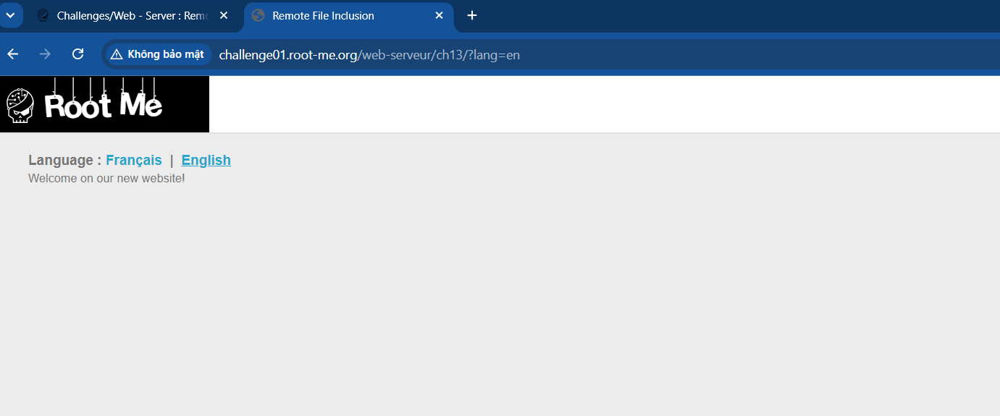
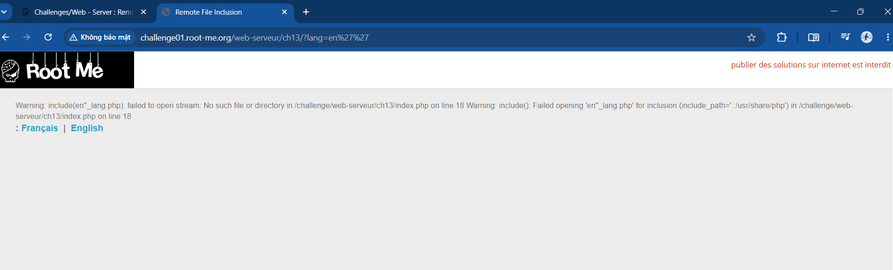
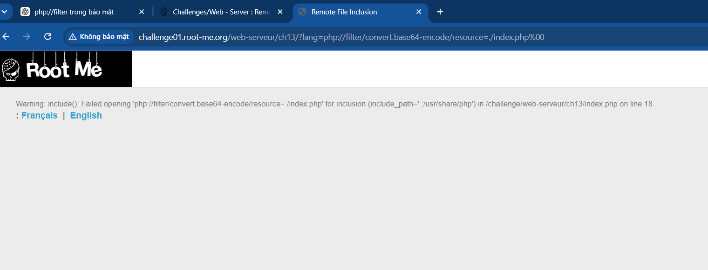
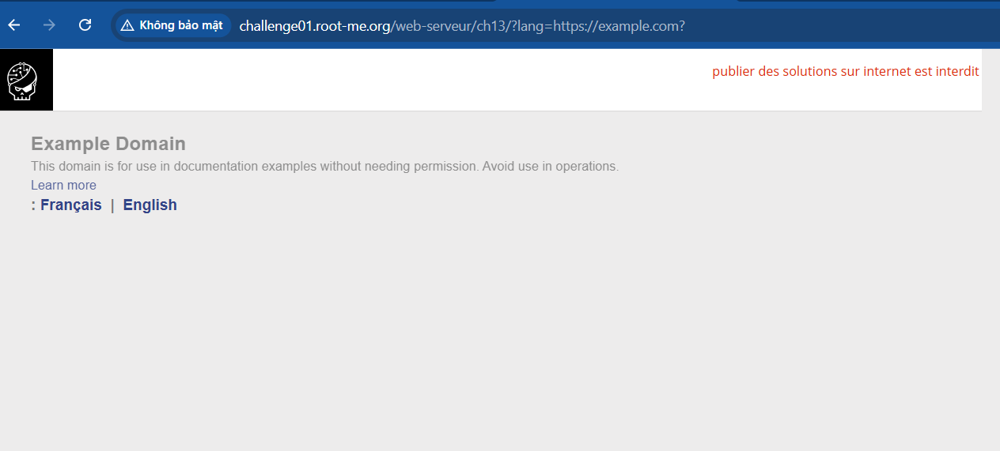
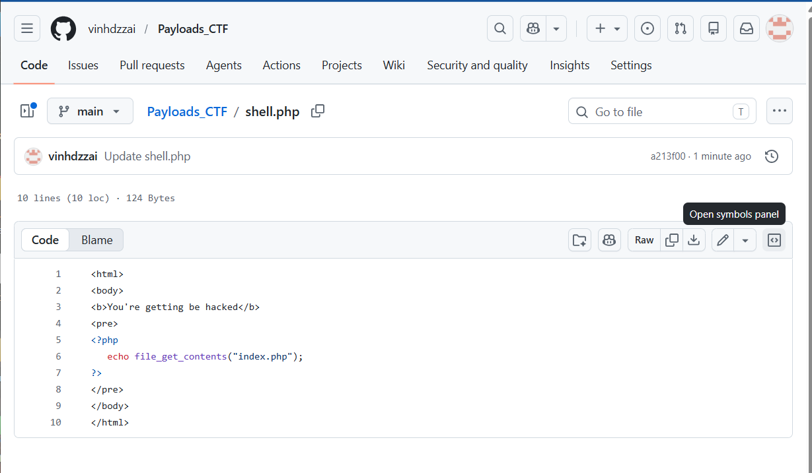
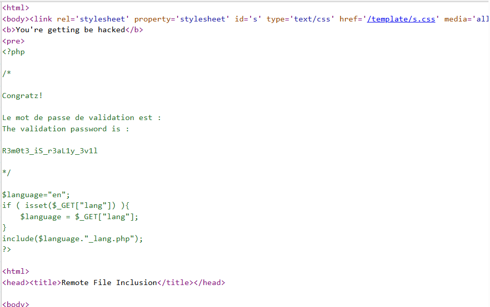

link challenge : https://www.root-me.org/en/Challenges/Web-Server/Remote-File-Inclusion
- nhiệm vụ bài này là đọc được source 

- Web chứa 2 chức năng là chọn ngôn ngữ bằng tiếng Francais hoặc English với URL có endpoint /?lang= 
- tôi cũng đã recon source , endpoint không phát hiện thêm gì
- khá chắc entry point bài này ở phần /?lang
- thử truyền giá trị bất thường để xem respone , tôi thử truyền dấu ''

- lỗi cho ta thấy input đang được gán trong hàm include($_GET['lang']+_lang.php) và đang được xử lý trong file index.php
- tôi thử dùng php://filter để đọc thử source , dùng %00 (null byte) để cắt chuỗi hậu tố _lang.php

- ta thấy respone null byte đã cắt hậu tố nhưng không thể thực thi , có lẽ đã index.php không resolve path giống với file được include, hoặc nó null byte thực sự không hoạt động hoặc something gets wrong?
- hàm include() ngoài file nó còn nhận 1 URL để nhận dữ liệu nếu chứa php thì thực thi còn lại trả raw data
- lúc này tôi thử truyền 1 URL xem nó trả data không và tất nhiên dùng thêm ? để hậu tố _lang.php biến nó thành query string không làm nhiễu URL
  
  -> http://example.com?_lang.php

- sau khi decode thực sự nó đã trả về dữ liệu trang
- lúc này ta cần 1 URL chứa mã php để chạy thực thi shell , tôi recommend sử dụng github để tự tạo 1 trang php (vì tôi k biết cách khác :b)
- vì hàm system tôi thử đã bị blacklist nên ta chọn cách khác như file_get_contents() hoặc readfile()

- gán URL git vào input

-> FLAG : R3m0t3_iS_r3aL1y_3v1l
