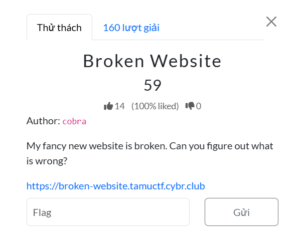
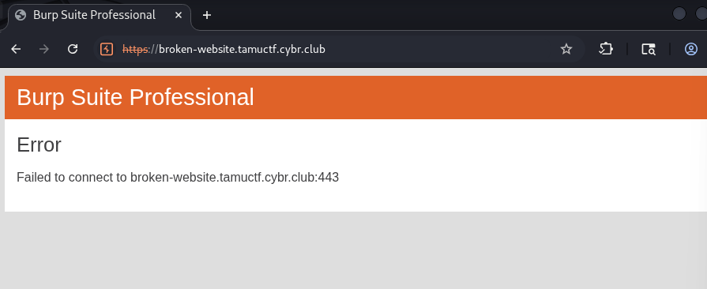
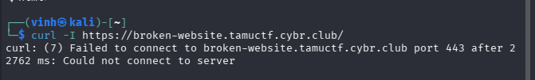
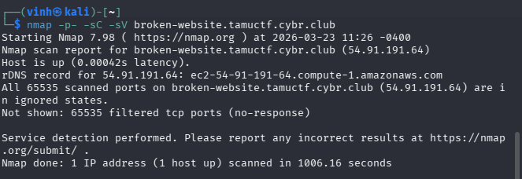
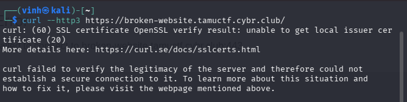
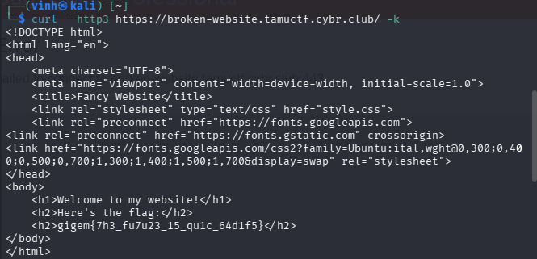

- Đầu tiên khi truy cập trang web và nó đã bị lỗi kết nối 

- đầu tiên tôi thử dùng lệnh curl để kiếm tra kết nối http với các option :
+ curl -I broken-website.tamuctf.cybr.club/
// chỉ lấy header

+ curl -I -k broken-website.tamuctf.cybr.club/
// để bỏ qua xác thực TLS
- .... và 1 vài lệnh tương tự nhưng cũng không có kết quả
- lúc này ta chắc chắn HTTP request đã bị chặn nên các bước xác thực bằng header là vô dụng
- tiếp theo tôi thử ping nhưng cũng bị chặn nốt
- lúc này có thể là web chạy ở cổng khác nên tôi dùng thử nmap :
- nmap -p- -sC -sV https://broken-website.tamuctf.cybr.club/ 
- nhưng kết quả là zero
  

- lúc này tôi đã nghĩ rằng trang web này đã chặn hết các request từ client hoặc không còn hoạt động và tôi đã nghĩ đến việc tìm domain/subdomain 
- vì là domain nên tôi nghĩ đến 1 số lỗ hổng liên quan đến nó , lệnh dig để lấy IP , 1 số bản ghi (TEXT , SOA,..) và quan trọng nhất nếu lấy được nameserver và cấu hình sai có thể dẫn đến AXFR 
- và well kết quả là không thu thập được gì
- đó là 1 số bước recon của tôi nhưng có vẻ khá useless 
- quay về vấn đề chính ta đã dùng các phương thức để cố gắng connect đến server nhưng đều bị chặn (từ curl, ping, nmap,..) 
- để ý những phương thức trên đều là dùng giao thức TCP để connect nhưng ta trong tầng giao vận ta còn giao thức UDP nữa
- và bản HTTP 3 dùng giao thức UDP thay vì TCP như thông thường lúc này ta xác minh xem web có dùng HTTP 3 hay không :
- curl --http3 https://broken-website.tamuctf.cybr.club
  

- well vậy là web này thực sự dùng HTTP3 (giao thức UDP) nên các bước recon trước (dùng TCP) đều fail là đúng 
- và ta đang bị không xác thực đúng certification do HTTP3 tích hợp TLS nên việc đổi sang cổng 80 là không thể -> ta dùng option -k để bỏ qua certificate
   

- FLAG : gigem{7h3_fu7u23_15_qu1c_64d1f5}

