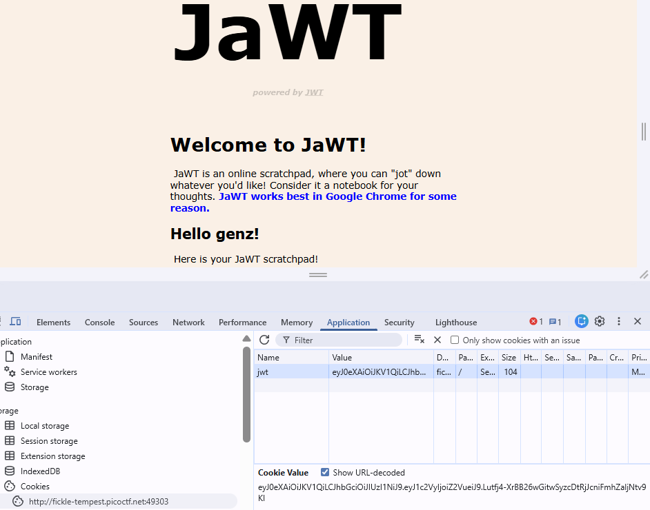
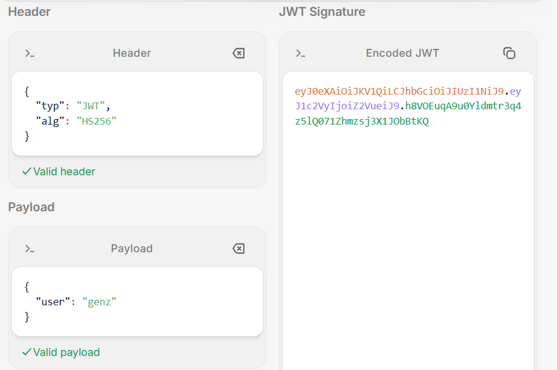
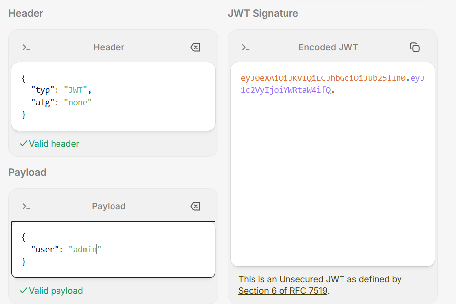
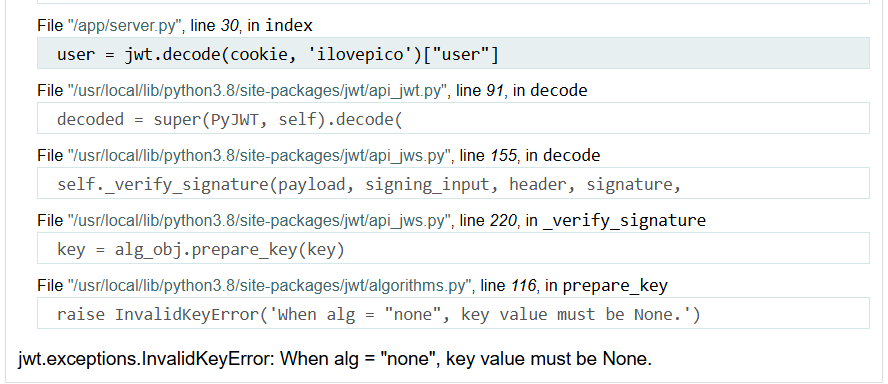

lab : https://play.picoctf.org/practice?category=1&page=6
- như tiêu đề là JWT thì việc trước hết nên làm là kiểm tra cookie
- tôi thử nhập để register với  1 username  “genz”

- sau khi có cookie ta đem decode ở jwt.io

- ta có thể thấy jwt dùng thuật toán HS256 và payload là dữ liệu người dùng truyền vào
- jwt gồm 3 phần header.payload.signature trong đó signature gồm :
signature = HMAC_SHA256(
    secret_key,
    base64url(header) + "." + base64url(payload)
)
- lúc này tôi có 2 hướng giải 
+ -> dùng tool để crack ra secret_key (như trong bài đã hint) 
+ -> thay đổi thuật toán về ‘none’ để không phải dùng đến secret_key nữa

- trước hết ta thử thay đổi thuật toán alg : “none” và user : “admin” sau đó thay đổi cookie và reload trang

- trang báo lỗi do ta đang chọn thuật tóan là none nhưng server đang lấy cookie và decode với secret_key = “ilovepico” mà đã có secret_key thì phải có thuật toán nên 2 thứ này đang lệch nhau -> xảy ra lỗi
- dù sao thì may mắn đã biết được secret nên tôi decode lại để lấy cookie của admin 

- sau đó chỉ việc thay cookie thôi
FLAG : picoCTF{jawt_was_just_what_you_thought_bbb82bd4a57564aefb32d69dafb60583}
- còn cách thứ 2 tôi vẫn brute-force ra secret với tool jack_the_ripper nhưng có vẻ lâu hơn
